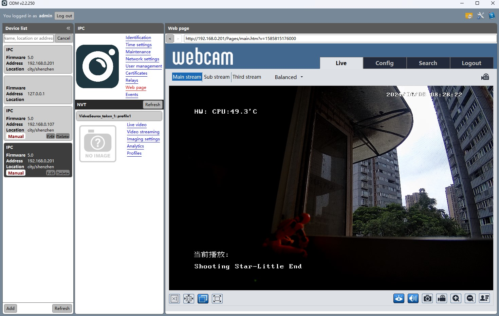
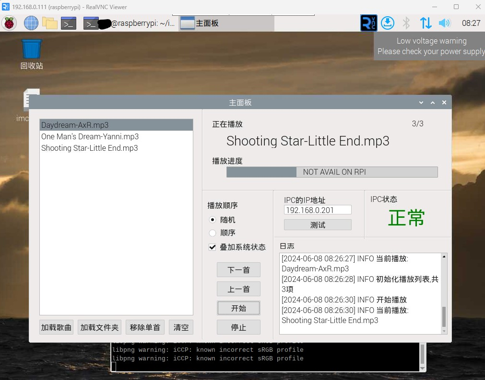
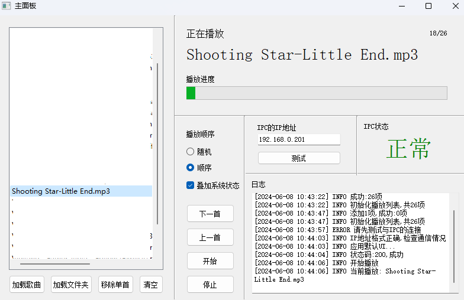

# ipcosd

在IPC上放音乐

## 注意:此仓库还未完善

## 使用方法:
1. 克隆仓库
2. 安装Pyqt5
3. 运行 ipcosd.py

## 运行截图

## 注意

1. 在开发时的IPC型号为[TD-9551E3A](http://cn.tvt.net.cn/upload/products/2022042017424627.pdf)，不保证所有设备通用

2. 这个摄像头的webui与摄像头的通信方式应该是Onvif，支持Onvif的设备应该都可以自己“扒”管理面板来适配
[适配方法](customize.md)